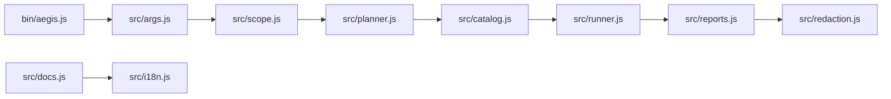

# Architecture

## Modules

- `src/cli.js`: command dispatch
- `src/scope.js`: authorization and allowlist checks
- `src/catalog.js`: safe check catalog loading and generation
- `src/planner.js`: target/mode selection
- `src/runner.js`: dry-run and passive execution orchestration
- `src/discovery.js`: passive route/form discovery
- `src/reports.js`: JSON, Markdown, HTML, and SARIF reports
- `src/redaction.js`: sensitive value masking
- `src/docs.js`: localized documentation generation

## Design Principles

- Verify scope before execution
- Prefer passive checks
- Store minimal evidence
- Redact before reporting
- Keep AI-facing data sanitized
- Make localized docs deterministic
